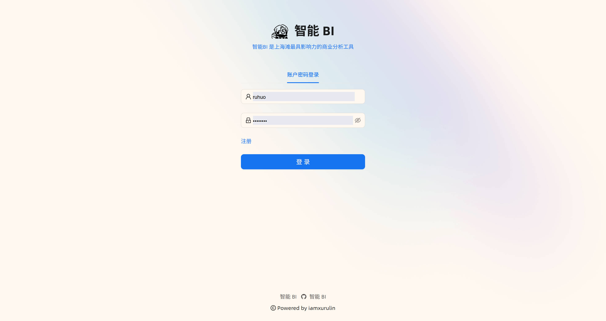
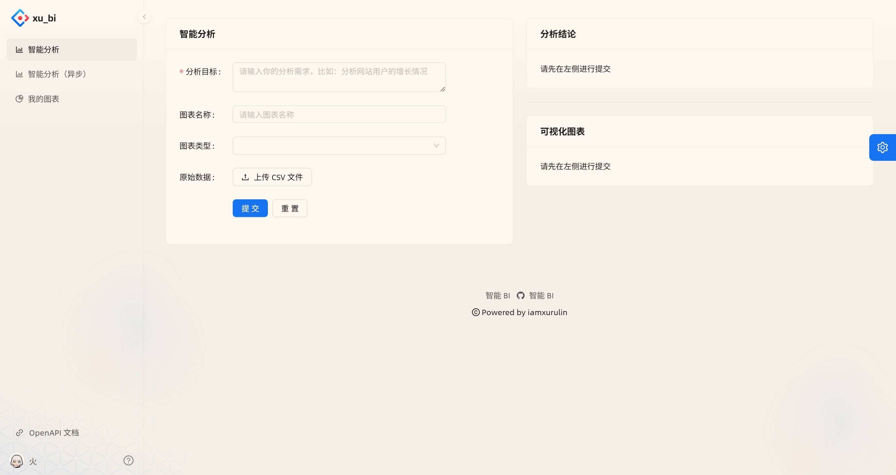
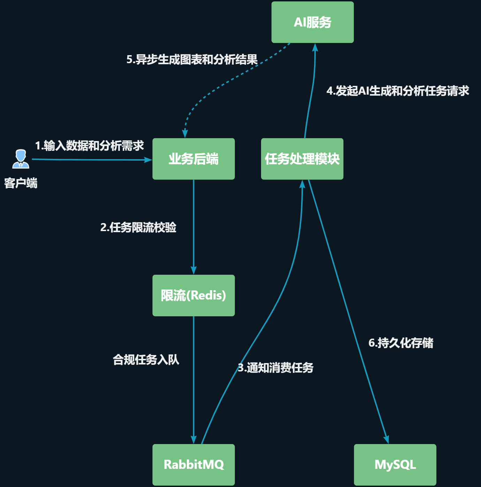

# 智能BI数据分析平台

**智能BI数据分析平台** 是一个数据分析工具，利用AI技术颠覆传统BI平台的复杂流程。传统BI需要手动导入数据、选择字段、配置图表，并依赖专业分析师才能得出结论。而本项目只需用户上传原始数据并输入分析目标（如“分析网站用户增长趋势”），AI即可自动生成可视化图表和深度分析结论。即使是零数据分析经验的用户，也能轻松实现高效决策。

## 项目地址

【[智能 BI](https://forkless-sueann-aglimmer.ngrok-free.dev/)】

## 项目展示图

## 架构图

## 为什么做这个项目？
- **AI赋能**：集成讯飞星火AI接口，自动解析数据、生成ECharts兼容的图表JSON和分析洞见，节省90%以上的手动分析时间。
- **用户友好**：一键上传Excel/CSV，输入自然语言目标，即得结果。适用于产品经理、市场分析师或初学者。
- **高性能**：异步处理机制（消息队列）支持大规模并发，避免AI调用瓶颈。

## 核心特性
- **智能分析**：上传原始数据 + 输入目标 → AI自动生成图表（柱状、折线、雷达等）和分析结论。
- **图表管理**：增删改查用户生成的图表，支持分页和权限控制（仅本人/管理员可编辑）。
- **异步生成**：使用RabbitMQ队列处理AI任务，避免阻塞，提升用户体验。
- **文件处理**：支持Excel/CSV上传，自动压缩和解析数据（使用EasyExcel）。
- **用户系统**：安全登录/注册，支持角色（user/admin）。
- **API文档**：集成Swagger + Knife4j，便于调试和扩展。

## 技术栈
### 前端
- **框架**：React + Umi + Ant Design Pro（企业级UI组件，快速构建精美界面）。
- **可视化**：ECharts / AntV（动态渲染AI生成的图表）。
- **代码生成**：Umi OpenAPI（自动生成后端调用代码，提升开发效率）。

### 后端
- **框架**：Spring Boot（快速搭建RESTful API）。
- **数据库**：MySQL + MyBatis-Plus（高效CRUD操作）。
- **消息队列**：RabbitMQ（异步处理AI任务）。
- **AI集成**：OpenAI API（或自定义接口，支持Prompt优化）。
- **工具**：EasyExcel（Excel解析）、Hutool（实用工具库）、Swagger（API文档）。

## 更新日志

### 前端

- 初始化Ant Design Pro原始模板

- 删除国际化配置

### 后端

- 初始化原始模板，测试连接数据库、用户注册、登录、发帖、通过帖子ID查看帖子

- 根据表xu_bi重构原始模板，测试登录流程

- 完成图表的增删改查操作

### 前端

- 前端调用后端

- 模板优化-logo、标题

### 后端

- 开发登录页面

- 智能分析业务的开发

- 调用讯飞星火AI

### 前端

- 开发前端页面，左侧显示用户表单，右侧显示生成的图表和数据分析的总结

- 使用ECharts库生成显示的图表

- 开发【我的图表】页面

### 后端

- 后端校验文件名后缀
- 实现分开查询
- 引入Redisson实现限流
- 完成线程池的开发
- 完成前后端异步化改造
- 引入RabbitMQ
- 参考官方文档实现1对1,1对多，发布订阅模式
- 测试Direct交换机
- 测试Topic交换机
- 给队列指定过期时间
- 实现死信队列
- 引入RabbitMQ消息队列实现异步智能分析

### 优化

- 支持用户查看图表原始数据
- 支持用户对失败的图表进行手动重试
- 支持用户对“待生成”的图表进行手动重试